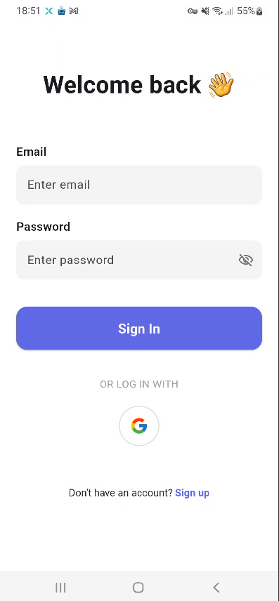
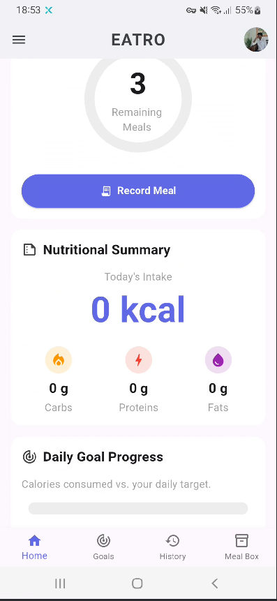
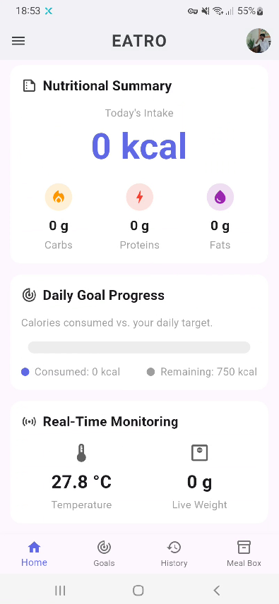
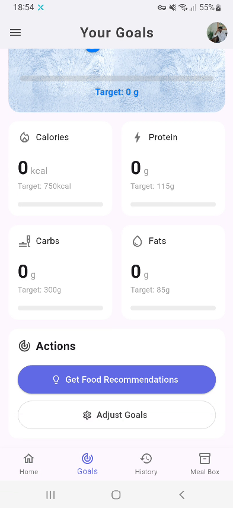
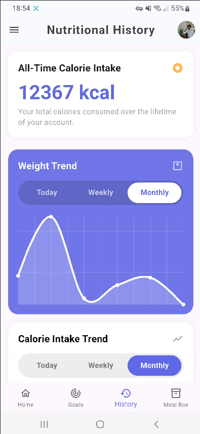
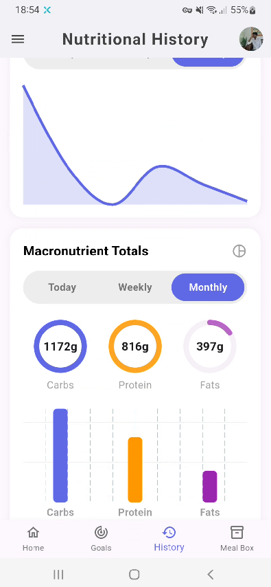
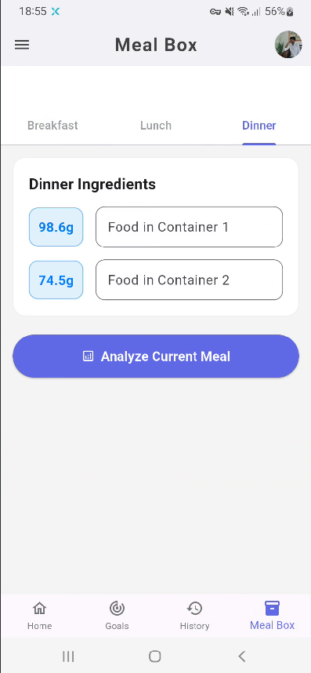
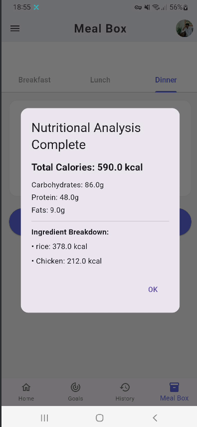

# Smart Meal Box - Mobile Application

<table>
  <tr>
    <td></td>
    <td></td>
    <td></td>
    <td></td>
  </tr>
  <tr>
    <td></td>
    <td></td>
    <td></td>
    <td></td>
  </tr>
</table>

## 📱 Mobile Application for IoT Smart Meal Box

The companion mobile app for the Smart Meal Box system that visualizes dietary data, tracks nutrition goals, and provides real-time monitoring of food consumption.

## ✨ Key Features

- **Real-time Dashboard**
  - Live weight measurements from meal box
  - Nutritional breakdown (calories, proteins, carbs, fats)
  - Temperature monitoring
- **Meal Tracking**
  - Automatic meal logging
  - Food type selection (user input)
  - Barcode scanner for packaged foods (future enhancement)
- **Data Visualization**
  - Daily/weekly intake charts
  - Progress toward custom goals
- **Smart Notifications**
  - Goal achievement alerts
  - Temperature warnings
  - Meal reminders

## 🛠️ Technical Stack

| Component         | Technology         |
| ----------------- | ------------------ |
| Frontend          | Flutter (Dart)     |
| Backend           | Firebase/Firestore |
| IoT Communication | MQTT/HTTP          |
| Charts Library    | fl_chart           |
| State Management  | Provider/Riverpod  |
